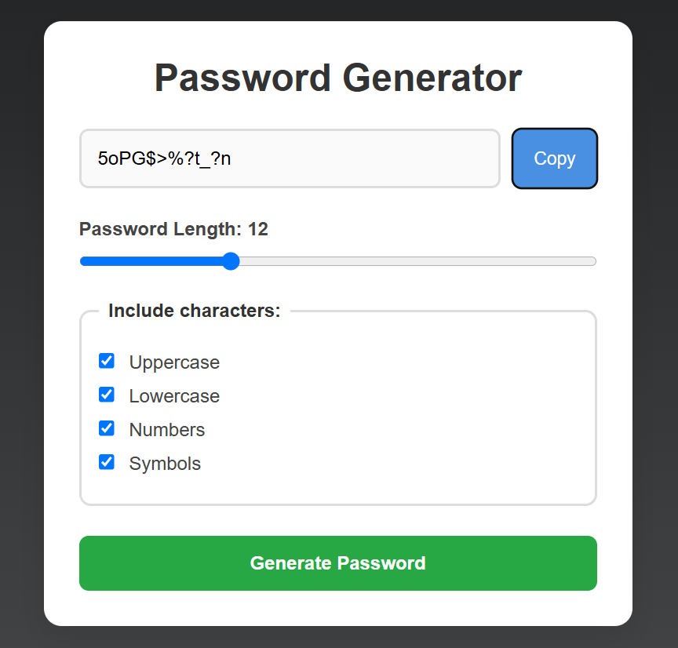

# Vanilla JS Password Generator App

A simple and responsive password generator built with HTML, CSS, and JavaScript. The application allows users to generate secure passwords based on selected criteria such as uppercase letters, lowercase letters, numbers, symbols, and custom password length.

## Features

* Generate random passwords instantly
* Adjustable password length using a range slider
* Include or exclude:

  * Uppercase letters
  * Lowercase letters
  * Numbers
  * Symbols
* Copy generated passwords to the clipboard
* Automatic password regeneration when settings change
* Responsive user interface
* Input validation when no character type is selected

## Technologies Used

* HTML5
* CSS3
* JavaScript (Vanilla JS)

## Project Structure

```text
vanilla-js-password-generator-app/
│
├── index.html
├── style.css
├── script.js
├── screenshot.png
└── README.md
```

## Screenshot



## How to Run

1. Clone the repository:

```bash
git clone https://github.com/your-username/vanilla-js-password-generator-app.git
```

2. Navigate to the project folder:

```bash
cd vanilla-js-password-generator-app
```

3. Open `index.html` in your browser.

## Learning Objectives

This project demonstrates:

* DOM manipulation
* Event handling
* Functions and loops
* Conditional logic
* Random password generation
* Clipboard API usage
* Responsive web design
